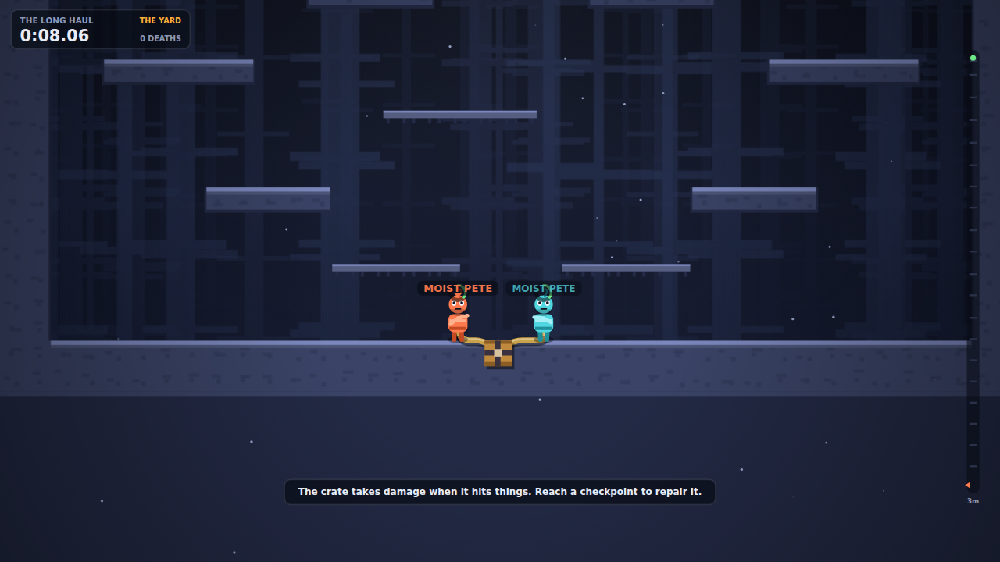

# HAULMATES

**A two-player co-op disaster about a rope, a crate, and the end of a friendship.**

Two haulers are tied together by a rope that will not stretch past its limit. Between
them dangles a fragile crate. Above them is a tower. Everything interesting in the game
comes out of those three facts: run too far and you drag your partner off a ledge, brace
yourself and they can swing from you, and the crate is always one bad landing from
matchwood.

Online play for two people, couch co-op for two people on one screen, a hand-authored
campaign and an endless seeded tower. Built to ship on Steam.



---

## Quick start

```bash
npm install
npm run dev
```

Open <http://localhost:5173> in **two browser tabs**. In the first: *Play online → Host a
haul*. In the second: *Play online → Join with a code*, and type the five-letter code from
the first tab. Both press Ready.

To play on one screen instead, pick *Couch co-op* — no server needed.

## The four verbs

| Action | Default key | Gamepad | What it is for |
|---|---|---|---|
| Move / jump | `A` `D` / `SPACE` | Stick / `A` | Ordinary, generous platforming. |
| **Grip** | `L-SHIFT` | Right trigger | Lock yourself in place on ground or wall. You become an anchor your partner can swing from. Drains, except on yellow rebar. |
| **Reel** | `F` | Left trigger | Drag yourself along the rope toward your partner. The fastest way up is usually the other person. |
| Emote | `T` | `Y` | Apologise. Or don't. |

Both players must hold `R` to reset to the last checkpoint.

## Commands

| Command | What it does |
|---|---|
| `npm run dev` | Matchmaking server + hot-reloading client |
| `npm test` | 60+ unit and integration tests (simulation, netcode, protocol, levels) |
| `npm run e2e` | Drives two real browsers through a real match and screenshots it |
| `npm run build` | Builds core, server and web client |
| `npm run verify` | Everything above, plus the packaged desktop self-test |
| `npm run art` | Regenerates all store art and installer icons |
| `npm run steam:config` | Regenerates the Steamworks achievement/stat/depot config |
| `npm run dist:win` / `dist:linux` / `dist:mac` | Builds the Steam-ready desktop app |

## How it is put together

```
packages/
  core/     Deterministic simulation, level format, wire protocol, netcode client
  server/   Authoritative matchmaking + tick server (Node, ws)
  client/   Renderer, procedural audio, menus, input (Vite, canvas)
  desktop/  Electron shell with Steamworks integration
tools/      Level authoring script
scripts/    Dev runner, packaging, art and config generation, end-to-end tests
steam/      Generated Steamworks configuration and store art
docs/       Design, netcode, launch checklist, store copy
```

**`core` is the contract.** It holds the entire simulation and nothing else — no DOM, no
Node APIs, no rendering. Both clients and the server run the identical `step()` function,
which is what makes rollback netcode possible. It never calls `Math.random`, `Math.sin`,
or any other function whose result is allowed to differ between platforms; there is a
test that enforces this by scanning the source.

**Nothing is loaded from disk at runtime.** Levels are ASCII art compiled into the bundle,
every sprite is drawn with canvas paths, and every sound — including the soundtrack — is
synthesised live in the Web Audio API. The whole game is a 44 KB gzipped download with no
asset licensing attached to it.

## Netcode in one paragraph

The server is authoritative and simulates the match at a fixed 60 Hz. Each client runs
*ahead* of the server by roughly half its round-trip time, predicting the partner's input
as "whatever they did last tick". When the server confirms what actually happened, any
tick where the prediction was wrong triggers a rollback: the last confirmed world is
copied forward and every tick since is replayed. The state is small enough (two players,
a fifteen-node rope, a crate, some crumbling blocks) that a worst-case rollback costs well
under a millisecond. The server also broadcasts a state checksum every second; a mismatch
pulls a full snapshot. See [docs/NETCODE.md](docs/NETCODE.md).

## Running a server

The game needs one server that both players connect to. It is a single Node process with
no database and no state worth backing up.

```bash
npm run build
node packages/server/dist/cli.js                       # ws://0.0.0.0:8787
node packages/server/dist/cli.js --static packages/client/dist   # also serves the web build
```

Environment variables: `PORT`, `HOST`, `HAULMATES_MAX_ROOMS`, `HAULMATES_ROOM_GRACE`,
`HAULMATES_LOG`. `GET /health` and `GET /stats` are available for monitoring.

A single small VM handles a few thousand concurrent rooms — each one is two sockets and a
60 Hz tick over about a kilobyte of state. Players can point the game at their own server
from the Settings screen, and the desktop build can host one in-process.

Once you have a server, set `HAULMATES_SERVER=wss://your-host` when building the desktop
app and it becomes the default for players.

## Shipping to Steam

The full checklist is in [docs/STEAM-LAUNCH.md](docs/STEAM-LAUNCH.md). The short version:

1. Buy the App ID, then `HAULMATES_APP_ID=<id> npm run steam:config`.
2. Set the same ID in `packages/desktop/src/main.ts` (or the `HAULMATES_APP_ID` env var).
3. `npm run dist:win` and `npm run dist:linux`; copy the output into `steam/content/`.
4. Upload with `steamcmd +run_app_build steam/app_build.vdf`.
5. Enter the achievements from `steam/achievements.json` on the partner site.
6. Replace the placeholder capsules in `steam/store/` with real art before launch.

## What is verified, and how

Running `npm run verify` exercises, in order:

- **60+ unit and integration tests** — simulation determinism over thousands of ticks,
  rollback convergence, snapshot round-tripping, physics invariants, level connectivity,
  protocol encoding, and full online matches against the real server under 25–130 ms
  latency, jitter, and a simulated connection freeze.
- **A browser end-to-end run** — two real Chromium clients connect to a real server, host
  and join a room, play a match, and are checked for byte-identical simulation state.
  Screenshots land in `test-results/`.
- **A packaged desktop self-test** — the built Electron binary is launched headlessly and
  checked for a working renderer, preload bridge and save file.

Not verified here, because it needs a Steam client and a real App ID: achievement
delivery, rich presence, and the Steam friend-invite flow. That code is written
defensively — every Steamworks call degrades to a no-op — and the game has been confirmed
to run correctly with Steam absent.

## Licence

All code and art in this repository is original. No third-party assets are bundled.
